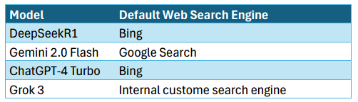

# 🔍 Evaluating Web Search Performance Across Top AI Assistants

*A comparative analysis of how leading AI models retrieve, process, and present web-sourced information.*  

 <!-- Include a relevant banner/image -->

## 📌 Overview
This repository contains a study comparing the web search capabilities of four AI assistants:  
**Gemini 2.0 Flash, ChatGPT-4 Turbo, DeepSeekR1, and Grok 3**. The research evaluates response speed, source credibility, citation practices, and ranking algorithm transparency.  

**Key Questions Explored**:  
- Which model balances speed and accuracy best?  
- How do AI assistants prioritize search results?  
- Do they cite reliable sources—or lean on social media?  

---

## 📋 Table of Contents
- [Models Tested](#-models-tested)
- [Methodology](#-methodology)
- [Key Findings](#-key-findings)
- [Repository Structure](#-repository-structure)
- [How to Use This Repository](#-how-to-use-this-repository)
- [Limitations](#-limitations)
- [Contributing](#-contributing)
- [License](#-license)
- [Contact](#-contact)

---

## 🤖 Models Tested
| Model              | Default Search Engine       | Version       |
|--------------------|-----------------------------|---------------|
| DeepSeekR1         | Bing                        | Free Tier     |
| Gemini 2.0 Flash   | Google Search               | Free Tier     |
| ChatGPT-4 Turbo    | Bing                        | Free Tier     |
| Grok 3             | Custom Engine               | Free Tier     |

---

## 🧪 Methodology
### **Query Categories**
1. **Factual Queries** (e.g., *"Boiling point of water"*)  
2. **Recent Events** (e.g., *"2024 UEFA Champions League winner"*)  
3. **Controversial Topics** (e.g., *"Ethics of genetic engineering"*)  
4. **Numerical/Statistical Data** (e.g., *"Global temperature anomaly 2023"*)  

### **Testing Process**
- **Response Timing**: Manual timer script built with Python.  
- **Citation Tracking**: Sources recorded for each response.  
- **Search Engine Disclosure**: Directly asked each model.  

---

## 🚀 Key Findings
### **Performance Metrics**
| Model              | Avg. Response Time | Total Citations | Social Media Citations |
|--------------------|--------------------|-----------------|------------------------|
| Gemini 2.0 Flash   | 4.2s               | 84              | 0                      |
| ChatGPT-4 Turbo    | 6.8s               | 88              | 0                      |
| DeepSeekR1         | 9.5s               | 79              | 1 (Facebook)           |
| Grok 3             | 5.1s               | 71              | 8 (Twitter/YouTube)    |

### **Insights**
- 🏆 **Speed vs. Depth**: Gemini 2.0 Flash was fastest; DeepSeekR1 provided the most detailed answers.  
- 📚 **Source Bias**: Wikipedia dominated citations (26/350 total), but Gemini prioritized .gov/.edu domains.  
- ⚠️ **Social Media Reliance**: Grok 3 cited Twitter 7x more than other models.  
- 🔍 **Algorithm Diversity**: Models using the same engine (Bing) ranked results differently.  

[Full findings here](/docs/Evaluating_Web_Search_Performance.docx)  

---

## 📂 Repository Structure
---

## 🛠 How to Use This Repository
1. **Replicate the Study**:  
   - Run the [timer script](/src/search_timer.py) to measure AI response times.  
   - Review the [raw data](/data/responses.xlsx) for citations and response details.  
2. **Extend the Research**:  
   - Add new queries to test additional categories (e.g., non-English prompts).  
   - Improve the timer with automated APIs (e.g., Selenium).  

---

## ⚠️ Limitations
- Manual timing may introduce human error.  
- Free-tier models may have rate limits or reduced features.  
- Small sample size (12 queries total).  

---

## 🤝 Contributing
Contributions are welcome! Ideas for expansion:  
- Add automated timing tools.  
- Test paid-tier models (e.g., Claude).  
- Analyze bias in cited sources.  
Submit issues or PRs with your improvements.  

---

## 📜 License
MIT License. See [LICENSE](/LICENSE) for details.  

---

## 📬 Contact
For questions or collaborations:  
- Email: [your-email@domain.com](mailto:your-email@domain.com)  
- LinkedIn: [Your Profile](https://linkedin.com/in/your-profile)  
